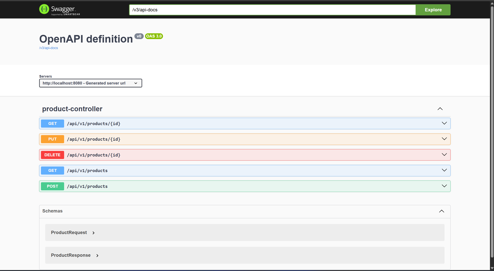
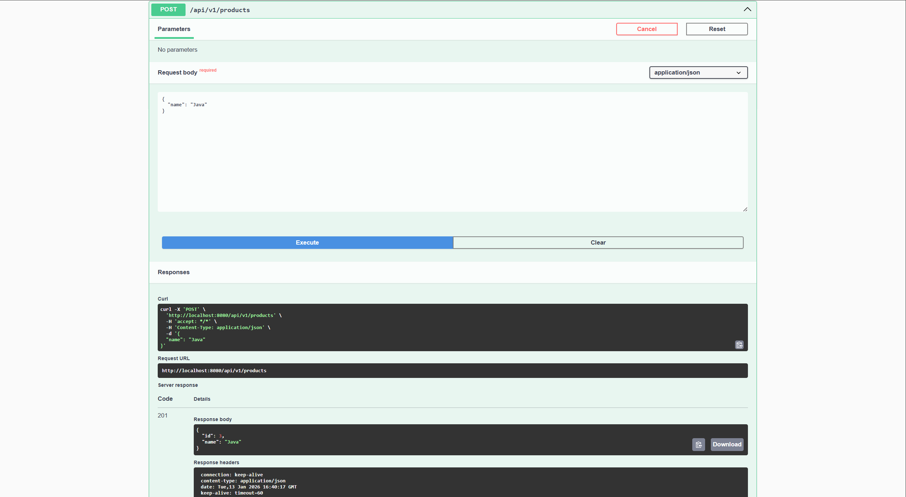
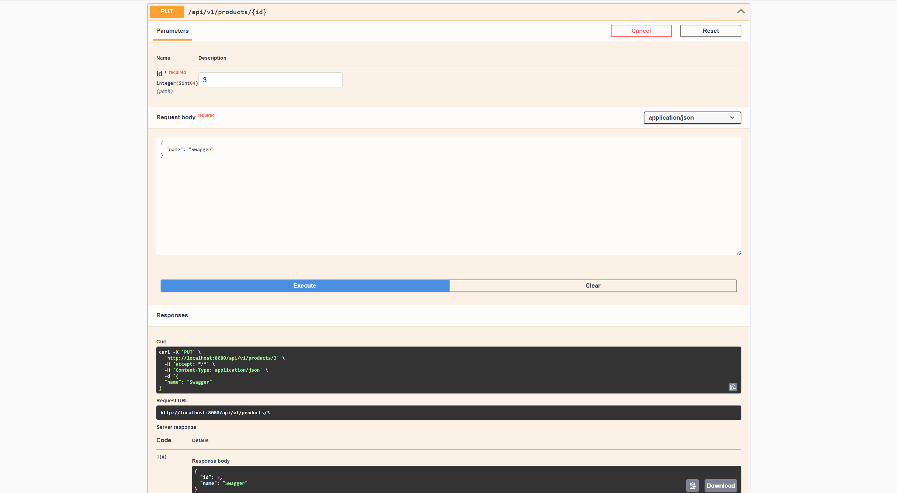
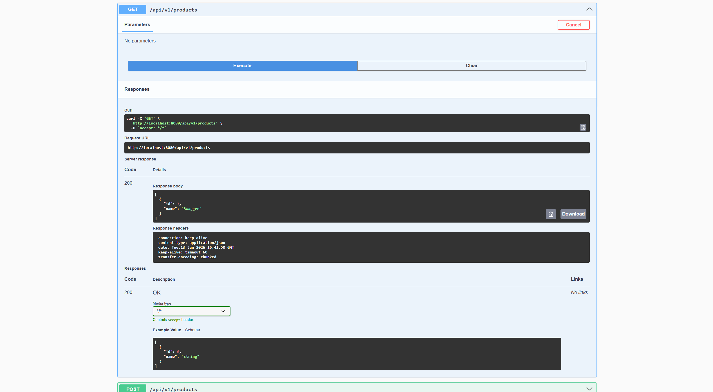
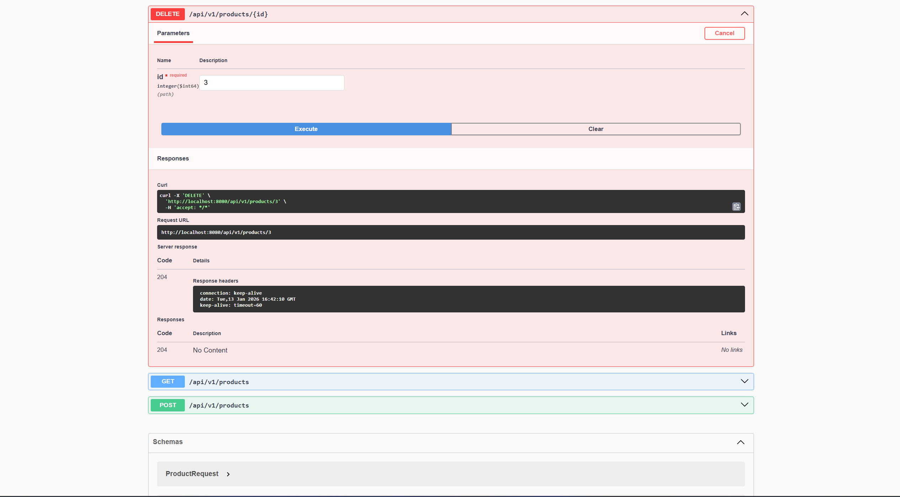
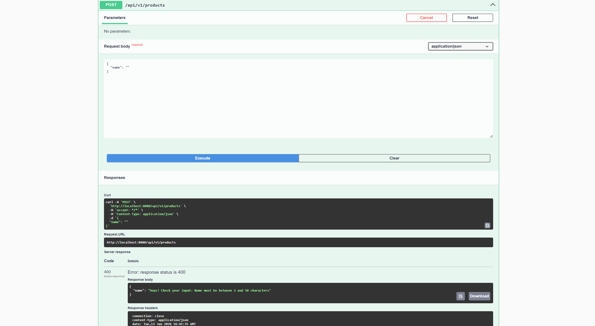
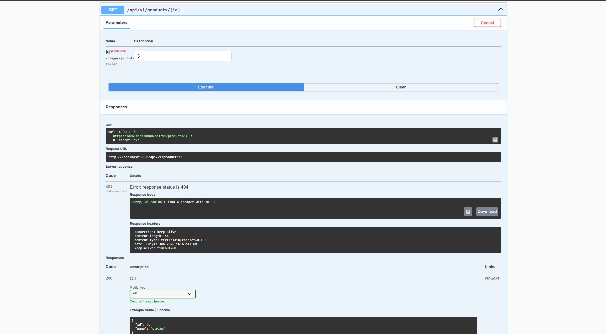
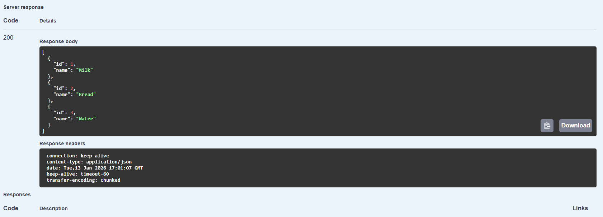
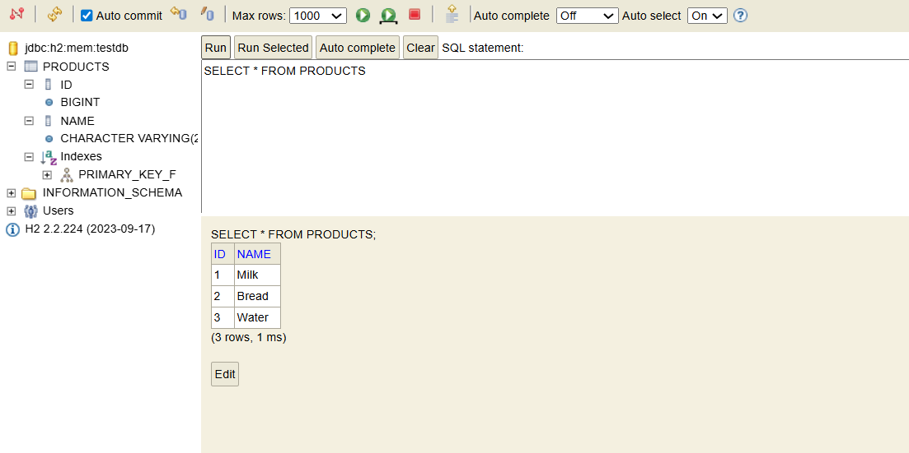

# Product Management API 

This is a Spring Boot REST API for managing products. It supports full operations, database and custom exception handling.

## Technologies
* Java 21 / Spring Boot 3
* H2 Database
* Swagger

## Implementation Details
1. All endpoints (GET, POST, PUT, DELETE) are working via Swagger UI at `http://localhost:8080/swagger-ui.html`.
2. Added `@Valid` for product requests. If the name is empty, it returns **400 Bad Request** with error message.
3. Searching for a non-existent ID returns **404 Not Found**.
4. Integrated H2 database. 

### API Overview
 POST creates products (201), GET lists them (200), DELETE removes them (204).

### Database Console
**H2 Console**: Accessible at `localhost:8080/h2-console`.

 
 

